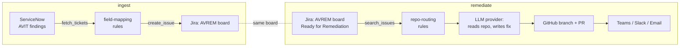

# ticket-remediation

Two independent automation pipelines that turn ServiceNow application-vulnerability findings
into merged code fixes with minimal human toil:

- **`ingest`** — reads application-vulnerability findings ("AVIT") from ServiceNow and creates
  corresponding Jira work items on the `AVREM` (Application Vulnerability Remediation) board,
  with component/label/metadata mapping you control via config, not code.
- **`remediate`** — polls the `AVREM` board for issues in `Ready for Remediation`, picks the
  right GitHub repo, asks a pluggable LLM provider to generate the code fix, opens a branch + PR
  against the repo's default branch, and notifies the team over MS Teams, Slack, and email.

Both are plain CLIs meant to be invoked by cron (or any scheduler) — there's no daemon or web
server to run. See [Configuration](#configuration) below for every environment variable they read.

## How it works



State (which SNOW ticket became which Jira issue, and which Jira issue already has a PR) lives
in a local SQLite file, so re-running either pipeline is safe — nothing gets created twice.

## Documentation

Full solution architecture documentation — system context, key decisions, C4 building-block and
UML class diagrams, sequence diagrams for every flow, the data/state model, use cases, deployment
views, and known risks — lives in [`docs/architecture/`](docs/architecture/README.md). Start
there for anything beyond "how do I run this."

## Prerequisites

- Python 3.11+
- [`uv`](https://docs.astral.sh/uv/) for dependency management and running commands
- `git`
- Accounts/credentials for whichever real services you point this at — see
  [Quickstart](#quickstart-zero-budget--local-mock-mode) for a path that needs none of them to
  start.

## Quickstart (zero-budget / local mock mode)

You don't need real ServiceNow or Jira accounts to develop against this project. Two local mock
servers implement the subset of the ServiceNow Table API and Jira REST API the connectors call,
seeded with synthetic AVIT findings and a seeded `AVREM` Jira project.

```bash
git clone https://github.com/roberjo/ticket-remediation.git
cd ticket-remediation
uv sync --extra mocks --group dev

cp .env.mock.example .env
# fill in GITHUB_TOKEN (a real token, scoped to a private sandbox repo) and
# GEMINI_API_KEY (free tier, no billing account required — get one at
# https://aistudio.google.com/apikey) in .env — see Configuration below.

uv run python -m mock_servers.run_all   # starts ServiceNow mock :8001 and Jira mock :8002

# in another shell:
uv run python -m ticket_remediation.ingest run --dry-run
uv run python -m ticket_remediation.remediate run --dry-run
```

Drop `--dry-run` once you've pointed `config/repo_routing.yaml` at a real sandbox repo you're
happy to have branches/PRs opened against (see
[roberjo/vulnerable-react-demo-app](https://github.com/roberjo/vulnerable-react-demo-app) for a
ready-made target with a handful of intentionally seeded vulnerabilities, and its own README for
how to run it).

## Quickstart (real free-tier sandboxes)

Both ServiceNow and Jira offer real, $0 developer sandboxes if you'd rather validate against
the actual APIs instead of (or in addition to) the local mocks:

- **ServiceNow**: [developer.servicenow.com](https://developer.servicenow.com) → request a free
  Personal Developer Instance (PDI). Full Table API, $0 forever, hibernates after ~7 days idle
  (click "wake up instance" in the portal to restart it).
- **Jira**: [atlassian.com/software/jira/free](https://www.atlassian.com/software/jira/free) →
  free Jira Cloud site (up to 10 users), real REST API, $0, no hibernation.

Copy `.env.example` to `.env`, fill in the real instance URLs/tokens, and run the same CLIs —
no code changes needed either way, since both mock and real modes are just different values for
`SNOW_INSTANCE_URL` / `JIRA_BASE_URL`.

## Configuration

All configuration is environment variables (see [`.env.example`](.env.example) for the full,
documented list) plus two YAML rule files. Nothing is hardcoded — every value below is meant to
be edited for your own org.

| File | Purpose |
|---|---|
| `.env` | Secrets and per-environment endpoints (never committed — see [Security](#security)) |
| [`config/ingest_mapping.yaml`](config/ingest_mapping.yaml) | SNOW table → Jira project/issue-type/component/label mapping rules |
| [`config/repo_routing.yaml`](config/repo_routing.yaml) | Jira project/component → target GitHub repo |

Key `.env` groups:

| Variable prefix | Controls |
|---|---|
| `SNOW_*` | ServiceNow instance URL, token, source table name |
| `JIRA_*` | Jira base URL, auth, project key, the JQL status `remediate` polls for |
| `GITHUB_TOKEN` | Used for both PR creation (PyGithub) and local git clone/push |
| `LLM_PROVIDER` + `ANTHROPIC_*` / `GEMINI_*` | Which LLM generates the fix — see below |
| `TEAMS_WEBHOOK_URL` / `SLACK_WEBHOOK_URL` / `SMTP_*` | Notification channels (each optional — only configured ones fire) |
| `SQLITE_DB_PATH` / `WORK_DIR` | Local state DB and scratch clone directory |

The LLM remediation step is provider-agnostic
(`src/ticket_remediation/connectors/llm/base.py::LLMProvider`), selected via `LLM_PROVIDER`.
Two implementations ship:

- **`gemini`** — Google's free tier, no billing account required. Get a key at
  [aistudio.google.com/apikey](https://aistudio.google.com/apikey); actual rate limits for your
  account are only visible live at [aistudio.google.com/rate-limit](https://aistudio.google.com/rate-limit).
  `.env.mock.example` defaults to this, so the whole pipeline can run at zero cost end to end.
- **`anthropic`** — paid, generally higher quality for complex fixes.

Adding another provider means implementing the `LLMProvider` protocol and one branch in
[`connectors/llm/factory.py`](src/ticket_remediation/connectors/llm/factory.py).

## Project layout

```
config/                     ingest field-mapping + repo-routing rules (YAML)
src/ticket_remediation/
  config/                    settings (env) + mapping config loaders
  db/                        sqlite idempotency state (snow<->jira links, PR run status)
  connectors/                servicenow, jira, github, llm, notify — each a Protocol + impl
  ingest/                    SNOW -> Jira pipeline + CLI
  remediate/                 Jira -> GitHub PR -> notify pipeline + CLI
mock_servers/                local FastAPI stand-ins for ServiceNow + Jira (zero-budget dev)
tests/                       unit tests (fixtures + Protocol fakes, no network by default)
```

`scaffold/vulnerable-react-demo-app/` is **not** part of this repo — it's its own independent git
repository (its own remote, history, and license), just kept as a sibling directory on disk here
for convenience while developing. See
[github.com/roberjo/vulnerable-react-demo-app](https://github.com/roberjo/vulnerable-react-demo-app).

Each connector (`servicenow`, `jira`, `github`, `llm`, `notify`) is a `typing.Protocol` plus one
or more concrete implementations, so pipeline logic can be unit-tested against hand-written fakes
instead of live services — see [`tests/unit/ingest/test_ingest_pipeline.py`](tests/unit/ingest/test_ingest_pipeline.py)
and [`tests/unit/remediate/test_remediate_pipeline.py`](tests/unit/remediate/test_remediate_pipeline.py)
for the pattern.

## Testing

```bash
uv run pytest              # fast, no network — Protocol fakes + respx-mocked HTTP
uv run pytest -m contract  # spins up mock servers in-process, hits them over real HTTP
uv run pytest --cov=ticket_remediation --cov-report=term-missing  # coverage, gated at 85% in CI
uv run ruff check .
uv run mypy src
uv run pip-audit           # scans the synced environment for known CVEs via the OSV/PyPI
                            # advisory DB; run after `uv sync --extra mocks --group dev` so dev/mock
                            # deps are covered too, not just core — needs outbound network access
                            # (unlike ruff/mypy, which run fully offline)
```

CI ([`.github/workflows/ci.yml`](.github/workflows/ci.yml)) runs `ruff` (including the
bandit-derived `S` security ruleset) and `mypy` once, then both `pytest` tiers with coverage on a
Python 3.11/3.12/3.13 matrix, and `pip-audit` (advisory, non-blocking) — on every push to `main`
and every PR.

`uv run pre-commit install` (once, after `uv sync`) adds a local pre-commit hook that scans staged
changes for secrets before they ever reach a commit — see [`.pre-commit-config.yaml`](.pre-commit-config.yaml).

## Security

- **Never commit `.env`.** It's git-ignored (`.gitignore` blocks `.env` and `.env.*`, with only
  the `.example` templates explicitly un-ignored). Only `.env.example` and `.env.mock.example`
  (no real values) belong in source control.
- If a real credential is ever accidentally committed or exposed, rotate it immediately at the
  source (GitHub token settings, Jira API tokens, the LLM provider's console, etc.) — removing it
  from a later commit does not remove it from git history.
- The `remediate` pipeline's LLM-generated file edits are written with a path-escape guard
  (rejects anything resolving outside the cloned repo's working directory) before being applied,
  since those paths originate from a model response.
- The sample target app under `scaffold/vulnerable-react-demo-app/` contains **intentional**
  vulnerabilities for demo purposes only — see that repo's own README before treating any of its
  patterns as something to copy into real code.
- Dependency-vulnerability scanning is in place via `pip-audit` (also runs in CI, see
  [Testing](#testing), but advisory/non-blocking rather than a hard gate) and GitHub Dependabot
  ([`.github/dependabot.yml`](.github/dependabot.yml), automated version-update PRs, still
  human-reviewed rather than auto-merged).

## Roadmap / out of scope for now

This is a v1 narrow slice, not a general-purpose platform. Deliberately not built yet:

- Multi-repo/multi-ticket-type routing beyond the one configured rule per YAML file (the schema
  already supports lists — add rules, no code changes needed)
- Webhook-driven triggers (currently polling-CLI only, invoked by cron)
- Retry/backoff frameworks — failures are logged and left for the next scheduled run to retry
- A human-approval gate on LLM-generated changes (GitHub PR review is the current checkpoint)
- Multi-tenant configuration, an admin UI, or DB migration tooling

## Contributing

This is currently a personal/portfolio project without a formal governance process. Issues and
PRs are welcome — see [CONTRIBUTING.md](CONTRIBUTING.md) for setup, the pre-submit checklist, and
the conventions this codebase already follows.

## License

[MIT](LICENSE)
