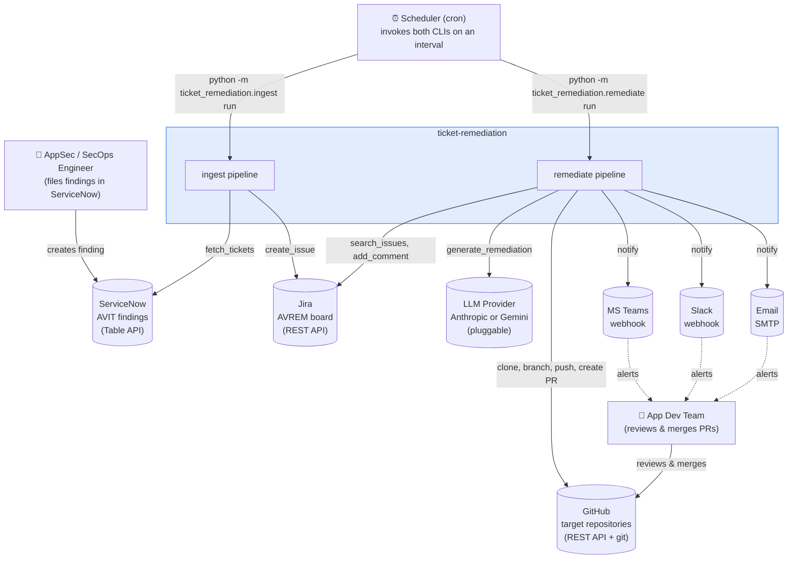

# 1. Introduction & Goals

## 1.1 Purpose

**ticket-remediation** automates the path from a discovered application/infrastructure
vulnerability to a merged fix, with a human reviewing only the final pull request:

1. A vulnerability finding lands in ServiceNow (AVIT — application-vulnerability findings).
2. The **`ingest`** pipeline turns it into a Jira work item on a remediation board, with
   component/label/metadata mapping controlled entirely by config.
3. Once triaged to "Ready for Remediation", the **`remediate`** pipeline picks the right GitHub
   repo, asks a pluggable LLM to read the repo and write the fix, opens a branch and PR, and
   notifies the team.
4. A human reviews and merges the PR. That review is the system's only manual gate.

## 1.2 Quality Goals

Ranked by priority — these drove most of the architectural decisions in
[Solution Strategy](02-solution-strategy.md):

| Priority | Quality Goal | What it means here |
|---|---|---|
| 1 | **Safety / idempotency** | Re-running either pipeline must never create duplicate Jira issues or duplicate PRs, and a partially-failed run must be resumable without manual cleanup. |
| 2 | **Zero-cost developability** | The entire system must be runnable and testable end-to-end with $0 in infrastructure or API spend (local mocks + a free-tier LLM). |
| 3 | **Extensibility** | Adding a new ticket source table, a new target repo, or a new LLM provider should mean editing config or adding one small implementation — not restructuring the pipeline. |
| 4 | **Testability** | Orchestration logic must be verifiable against fakes, without hitting real ServiceNow/Jira/GitHub/LLM services in the default test run. |
| 5 | **Auditability** | Every created Jira issue, every branch, and every PR must be traceable back to the originating SNOW ticket and forward to the PR that resolved it. |

## 1.3 Stakeholders

| Role | Concern |
|---|---|
| **AppSec / SecOps engineer** | Owns the ServiceNow AVIT findings and the field-mapping rules; wants findings to reliably become tracked, correctly-labeled Jira work. |
| **App dev team** | Owns the target repositories; reviews and merges the PRs the system opens; wants correct, minimal, well-explained diffs — not noise. |
| **Platform / project owner** | Configures credentials, repo routing, and the LLM provider; wants the system to fail loudly and safely rather than silently or destructively. |
| **Scheduler (cron)** | Not a person, but a first-class actor: invokes both CLIs on an interval and needs a clean, scriptable exit-code contract. |

## 1.4 Constraints

- **Python 3.11+, managed with `uv`.** No other language runtime in the core system.
- **No inbound network exposure in v1.** Both pipelines are outbound-polling CLIs invoked by
  cron; there is no webhook receiver or long-running server (see [ADR-2](02-solution-strategy.md)
  for why, and how that seam is kept open for later).
- **No external infrastructure beyond SQLite.** State/idempotency lives in one local file —
  no database server, no message queue, no cache layer.
- **Credentials only via `.env`**, never hardcoded, never committed (see
  [Cross-Cutting Concerns](08-cross-cutting-and-risks.md#security)).
- **One human checkpoint.** By design there is no automated-approval or auto-merge path — GitHub
  PR review is the only gate between an LLM-generated diff and production code.

## 1.5 System Context

**External systems, and what the system needs from each:**

| System | Direction | Used for |
|---|---|---|
| ServiceNow | read-only | Source of AVIT vulnerability findings (`GET /api/now/table/{table}`) |
| Jira | read + write | The `AVREM` board: create issues, search by JQL, comment, transition |
| GitHub | read + write | Repo metadata, cloning/branching/pushing, and PR creation |
| LLM Provider (Anthropic / Gemini) | read (stateless per call) | Reads repo files via a bounded tool-use loop, returns the fix as full file contents |
| MS Teams / Slack / Email | write-only | Fire-and-forget notification of an opened PR |

In local zero-budget development, ServiceNow and Jira are two FastAPI mock servers standing in
for the real APIs — see [Deployment View](07-deployment-view.md) — so this context diagram is
identical in shape whether you're running against mocks or the real services; only the endpoint
URLs differ.
