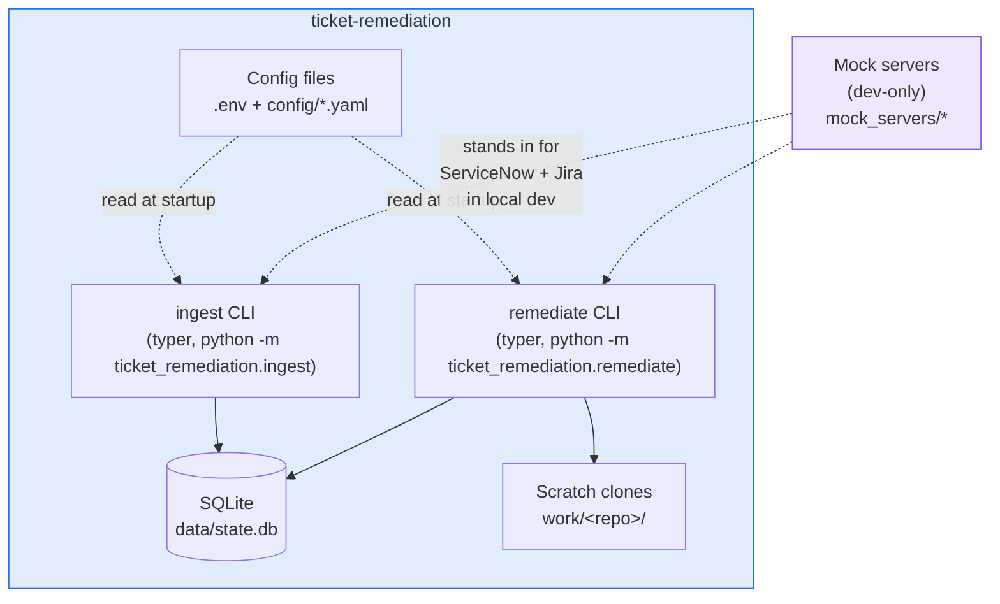
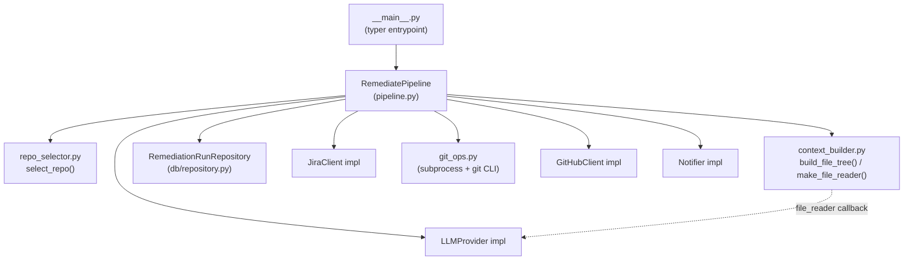
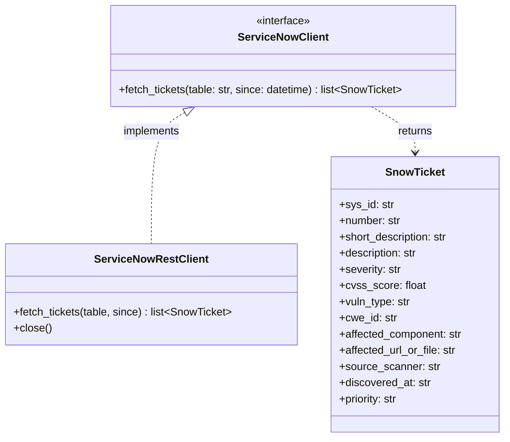
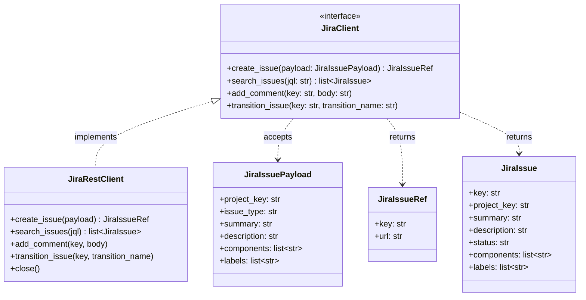
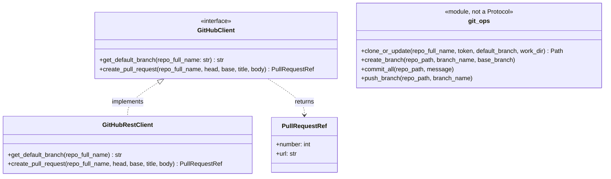
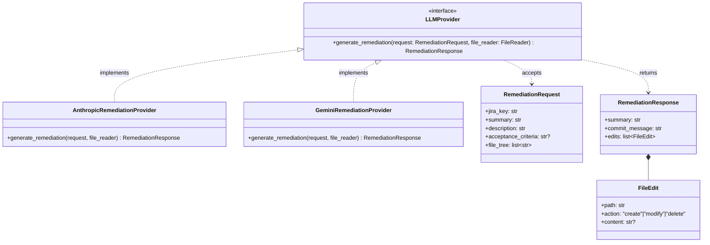
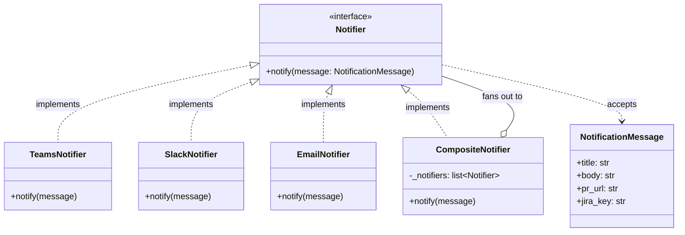

# 3. Building Block View

## 3.1 Level 2 — Containers



Both CLIs are independent OS processes with no shared runtime state beyond the SQLite file and
the YAML config — either can run without the other, and in production they're two separate cron
entries. `mock_servers/` is a development-only container: it's never imported by
`src/ticket_remediation/*` and has no presence in a real deployment.

## 3.2 Level 3 — Components (remediate pipeline)



`RemediatePipeline` is the only component that talks to every connector — it's the orchestrator,
not any individual connector. This mirrors `IngestPipeline`, which is the same shape one level
smaller (talks to `ServiceNowClient`, `JiraClient`, and `LinkRepository` only).

## 3.3 Module structure

```
src/ticket_remediation/
  logging_config.py           configure_logging()
  config/
    settings.py                 Settings (pydantic-settings, reads .env)
    mapping.py                  IngestMappingConfig / RepoRoutingConfig (+ YAML loaders)
  db/
    schema.sql                  CREATE TABLE IF NOT EXISTS x2
    connection.py                get_connection(path) -> sqlite3.Connection
    repository.py                LinkRepository, RemediationRunRepository
  connectors/
    servicenow/  base.py (Protocol) + rest.py (httpx impl)
    jira/        base.py (Protocol) + rest.py (httpx impl)
    github/      base.py (Protocol) + rest.py (PyGithub impl) + git_ops.py (local git, no Protocol)
    llm/         base.py (Protocol) + factory.py + limits.py + anthropic_provider.py + gemini_provider.py
    notify/      base.py (Protocol) + teams.py + slack.py + email_notifier.py + composite.py
  ingest/
    mapper.py                   SnowTicket -> JiraIssuePayload
    pipeline.py                  IngestPipeline
    __main__.py                   typer CLI
  remediate/
    repo_selector.py             JiraIssue -> RepoRouteTarget
    context_builder.py            file tree + bounded file_reader for the LLM
    pipeline.py                    RemediatePipeline
    __main__.py                     typer CLI

mock_servers/                  dev-only, never imported by src/
  common/state.py               RecordStore + /_debug/reset helper
  servicenow_mock/               vuln_catalog.py, generator.py, app.py (FastAPI)
  jira_mock/                      jql.py, app.py (FastAPI)
  run_all.py                      starts both mocks in one process
```

`git_ops.py` is deliberately **not** behind the `GitHubClient` Protocol — it's a set of plain
functions wrapping the `git` CLI via `subprocess`, kept separate from the PyGithub-backed remote
API client (`rest.py`) because they're genuinely different concerns (local filesystem git state
vs. remote GitHub API calls) with different failure modes and different testing strategies (argv
assertions + a real local-repo integration test, vs. mocked HTTP).

## 3.4 Connector interfaces (UML class diagrams)

Every connector follows the same shape: a `Protocol` (structural interface) plus one or more
concrete implementations, plus the pydantic models that cross the boundary.

### ServiceNow



Read-only by design (ADR in [Solution Strategy](02-solution-strategy.md)): idempotency is
tracked locally, not by writing back to ServiceNow.

### Jira



### GitHub



### LLM provider



`FileReader` (referenced by the interface) is `Callable[[str], str]`, not a class — a plain
bounded callback built per-run by `context_builder.make_file_reader()`, so it isn't part of the
class hierarchy above. See [Runtime View](04-runtime-view.md) for how it's actually used inside
the provider's read loop.

### Notify



`CompositeNotifier` both *implements* `Notifier` (so callers don't need to know how many channels
are configured) and *composes* a list of other `Notifier`s — a fan-out that only includes the
channels with a configured endpoint (`build_notifier()` in `composite.py`), and logs rather than
raises if one channel fails, so one bad webhook can't block the others.
