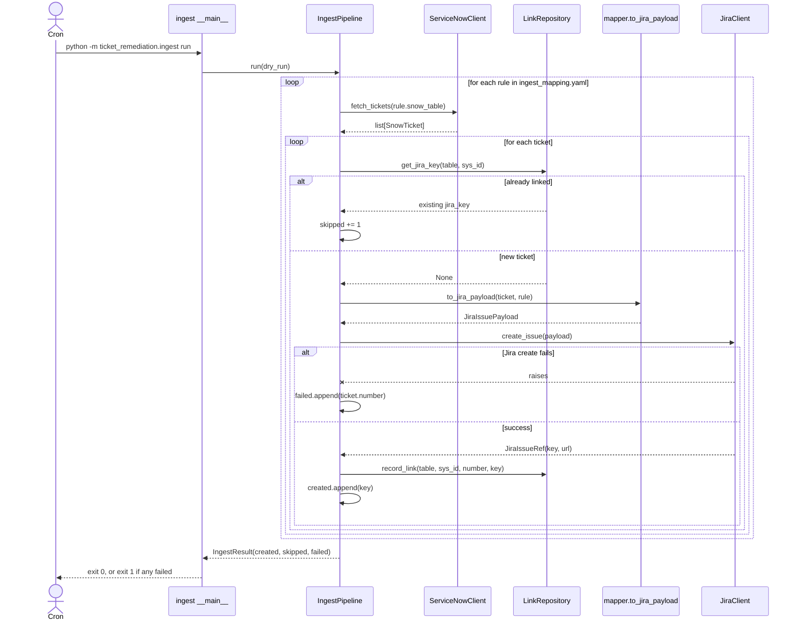
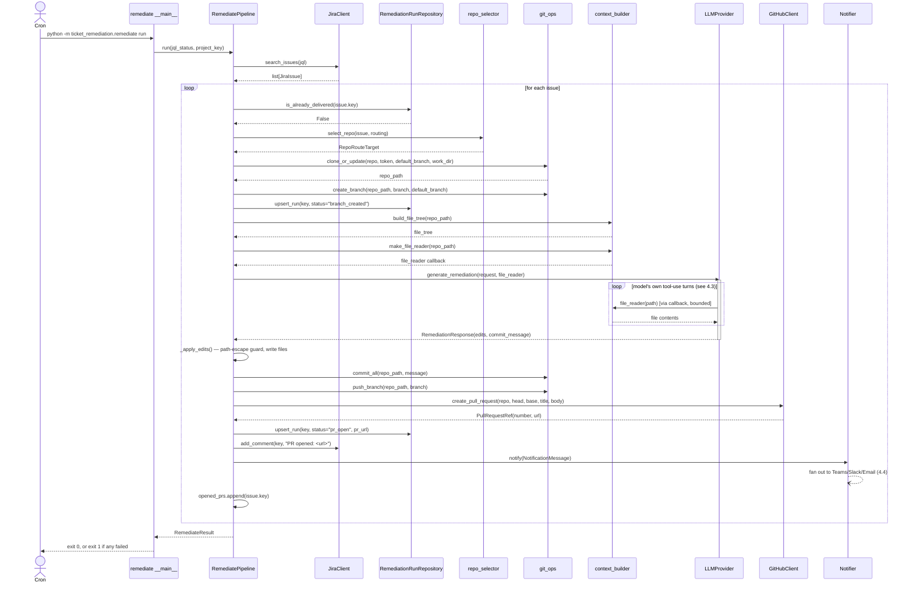
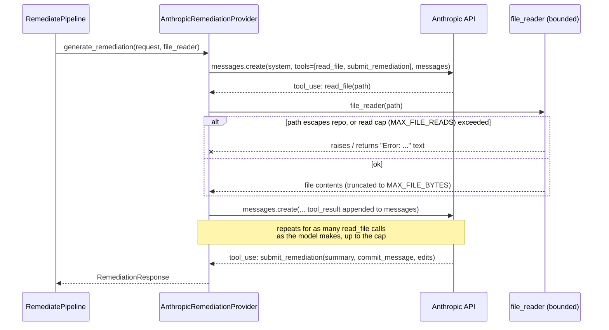
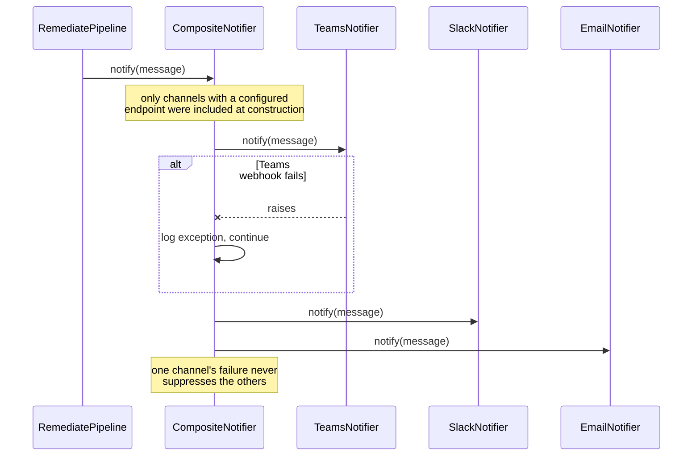
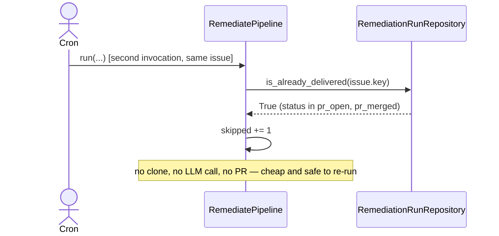
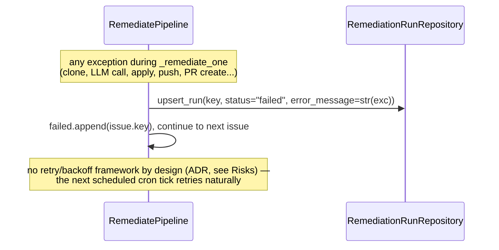

# 4. Runtime View

## 4.1 Ingest: SNOW ticket → Jira issue

The per-ticket link check is what makes re-running safe: a second run against the same SNOW data
produces `skipped` for every ticket that was already turned into a Jira issue, and creates
nothing new.

## 4.2 Remediate: happy path (Jira issue → PR)

## 4.3 LLM provider's internal tool-use loop

The step drawn as one box above ("generate_remediation") is itself a multi-turn loop — shown here
for the Anthropic provider; the Gemini provider is the same shape using its `interactions` API
(`previous_interaction_id` instead of a resent message list).

A read past `MAX_FILE_READS` doesn't raise back to the pipeline — it's fed to the model as an
error string ("max file-read limit reached, submit now"), nudging it to finish rather than
crashing the run. If the model ends its turn without ever calling `submit_remediation`, *that*
does raise (`ValueError`), which the pipeline catches and records as `status="failed"`.

## 4.4 Notification fan-out

## 4.5 Idempotent skip and failure paths

