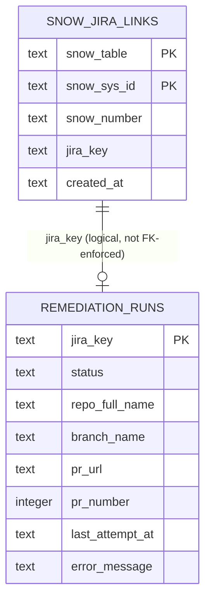
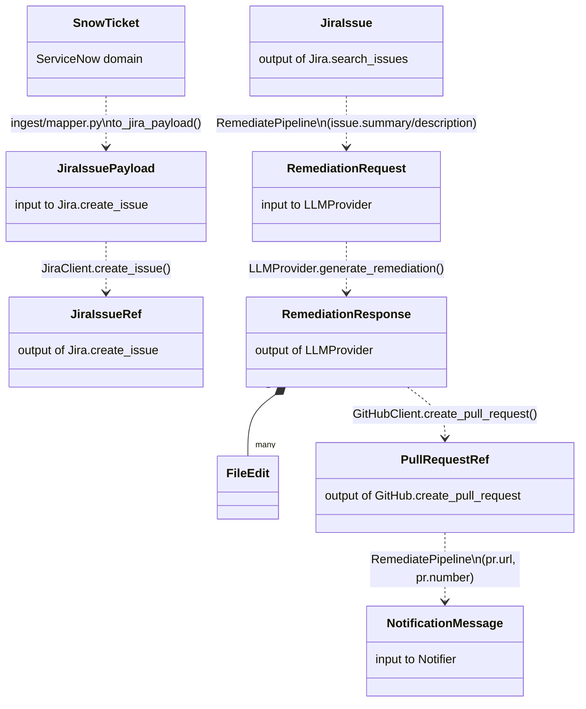
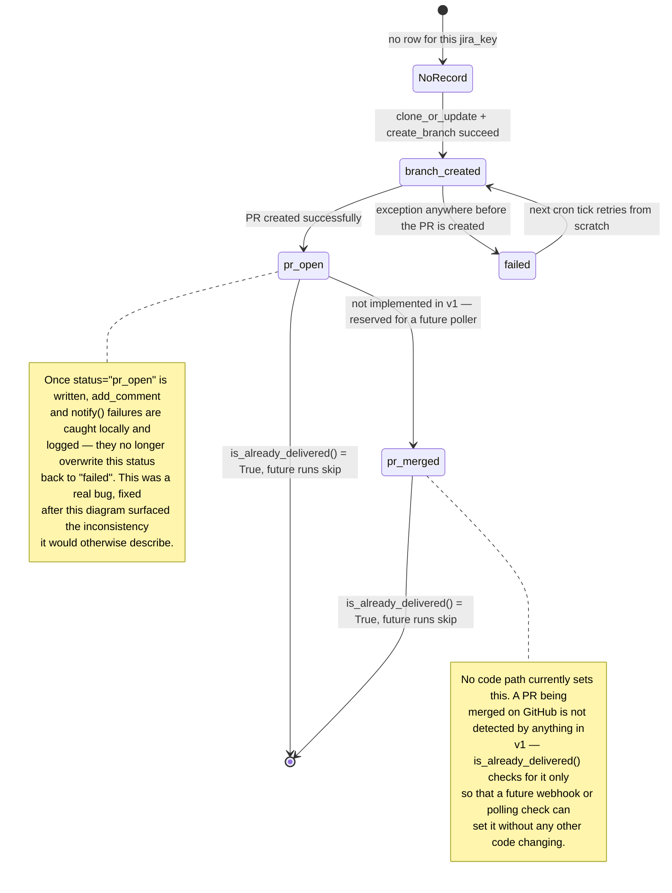

# 5. Data & State Model

## 5.1 Entity-relationship diagram (SQLite state)

`data/state.db` holds exactly two tables, both created via `CREATE TABLE IF NOT EXISTS` (no
migration tool — see [ADR-3](02-solution-strategy.md#adr-3-stateidempotency-lives-in-one-local-sqlite-file)).
They are not foreign-keyed to each other; the join between them is logical (`jira_key`), not
enforced by the schema, because a `snow_jira_links` row is written by `ingest` and a
`remediation_runs` row by `remediate` — two independent processes that never share a transaction.

| Table | Written by | Read by | Purpose |
|---|---|---|---|
| `snow_jira_links` | `IngestPipeline` | `IngestPipeline` | "Has this exact SNOW ticket already become a Jira issue?" — primary key is the natural key `(snow_table, snow_sys_id)`, so a second `INSERT` for the same ticket is a no-op (`ON CONFLICT DO NOTHING`). |
| `remediation_runs` | `RemediatePipeline` | `RemediatePipeline` | "Does this Jira issue already have a delivered PR?" plus a progress trail (`branch_created` → `pr_open`) so a crashed mid-run is inspectable via the `sqlite3` CLI. |

## 5.2 Domain model — the transformation chain

Data flows through a chain of pydantic models, each owned by the connector whose boundary it
crosses. Nothing is a raw `dict` at a pipeline boundary — every hop is a typed, validated model.

Note what's conspicuously absent from this chain: there is no `SnowTicket` field that flows
directly into `RemediationRequest`. The link is entirely through Jira — `ingest` creates the Jira
issue and stops; `remediate` starts from the Jira issue and has no knowledge of the original SNOW
ticket beyond what made it into the issue's `summary`/`description`. This is intentional: the two
pipelines are independently runnable and independently testable (see
[Solution Strategy](02-solution-strategy.md)), and Jira is the single source of truth once a
finding has been triaged.

## 5.3 State machine — `remediation_runs.status`

`is_already_delivered()` (`db/repository.py`) is the single idempotency gate `RemediatePipeline`
checks before doing any work — it returns `True` for `pr_open` or `pr_merged`, `False` for
everything else (including `NoRecord`, `branch_created`, and `failed`), which is exactly why a
`failed` run is retried on the next tick rather than stuck.
