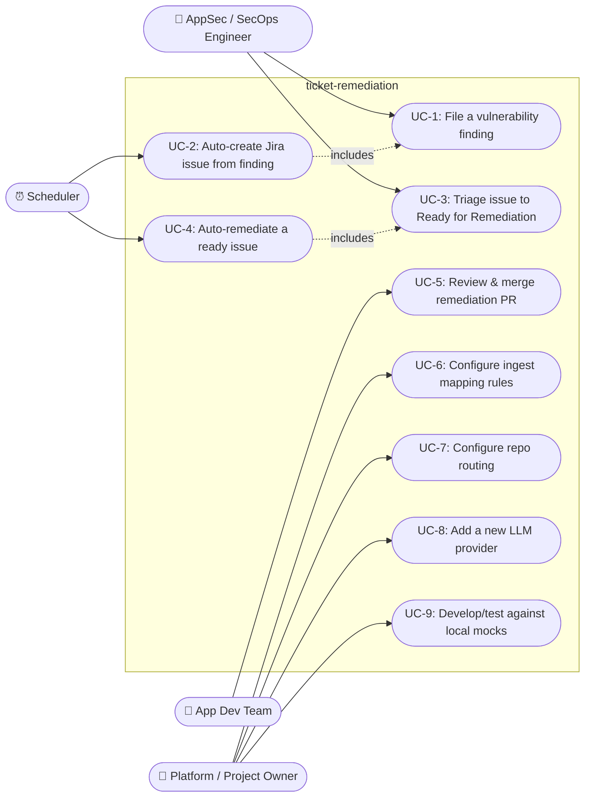

# 6. Use Cases

## 6.1 Actors

| Actor | Type | Role |
|---|---|---|
| **AppSec / SecOps Engineer** | Human | Files findings in ServiceNow; triages Jira issues to "Ready for Remediation" |
| **App Dev Team** | Human | Reviews and merges (or rejects) the PRs the system opens |
| **Platform / Project Owner** | Human | Configures credentials, mapping rules, repo routing, and the LLM provider |
| **Scheduler (cron)** | System | Invokes `ingest run` and `remediate run` on an interval |
| **`ingest` pipeline** | System | Automated actor for UC-2 |
| **`remediate` pipeline** | System | Automated actor for UC-4 |

## 6.2 Use-case diagram

## 6.3 Use-case descriptions

### UC-2: Auto-create Jira issue from a ServiceNow finding

- **Actor:** Scheduler (triggers), `ingest` pipeline (performs)
- **Preconditions:** A `SnowTicket` exists in the configured table; no `snow_jira_links` row
  exists yet for its `(table, sys_id)`; `config/ingest_mapping.yaml` has a rule for that table.
- **Main flow:**
  1. Scheduler invokes `python -m ticket_remediation.ingest run`.
  2. For each mapping rule, fetch tickets from that SNOW table.
  3. For each ticket not already linked, map it to a `JiraIssuePayload` (project, issue type,
     component, labels, summary/description — all from the rule's templates) and create the
     Jira issue.
  4. Record the SNOW-ticket → Jira-key link.
- **Alternate flow — already linked:** Skip silently (counted, not logged as an error); this is
  what makes re-running the same poll window safe.
- **Alternate flow — Jira create fails:** Log the exception, record the ticket number as failed,
  continue with the next ticket. No link is recorded, so the next run retries it.
- **Postconditions:** A new Jira issue exists in status `Backlog` with the mapped
  component/labels; a `snow_jira_links` row exists preventing a duplicate.

### UC-4: Auto-remediate a Jira issue

- **Actor:** Scheduler (triggers), `remediate` pipeline (performs)
- **Preconditions:** A Jira issue on the configured project is in the configured JQL status
  ("Ready for Remediation" by default); `config/repo_routing.yaml` has a route matching the
  issue's project and at least one of its components; no `remediation_runs` row for that issue
  has `status` in `(pr_open, pr_merged)`.
- **Main flow:**
  1. Scheduler invokes `python -m ticket_remediation.remediate run`.
  2. Search Jira for matching issues.
  3. For each issue: resolve the target repo, clone/update it, create a fix branch.
  4. Hand the repo's file tree and a bounded file-read tool to the configured LLM provider along
     with the issue's summary/description; receive back a set of full-content file edits.
  5. Apply the edits (rejecting any path that escapes the repo).
  6. If the repo route configures a `verify_command`, run it in the repo's working directory; a
     nonzero exit or timeout stops here — see the alternate flow below.
  7. Commit, push, open a PR against the repo's default branch; comment the PR link back onto the
     Jira issue; notify the configured channels.
- **Alternate flow — already delivered:** Skip (see [state model](05-data-and-state-model.md)).
- **Alternate flow — verification fails:** The repo route's `verify_command` (its own
  lint/build/test command) exits nonzero or times out. Recorded as `status="failed"`,
  `stage="verify"` — no commit, push, or PR happens, so a syntactically broken or test-failing
  edit never reaches human review looking like an untested one. Opt-in per route; a route with no
  `verify_command` configured behaves exactly as before.
- **Alternate flow — no repo route:** Log a warning, record as failed, continue to the next
  issue — this is a configuration gap (add a route), not a transient failure, so the *next* run
  will fail the same way until routing is fixed.
- **Alternate flow — failure before the PR exists:** Any exception (clone, LLM call, apply,
  push) is caught, the run is recorded `status="failed"`, and the pipeline continues to the next
  issue. The next scheduled run retries from scratch.
- **Alternate flow — failure after the PR exists:** A failure in the Jira-comment or
  notification step is caught and logged *without* undoing the already-recorded `pr_open` status
  — the PR is the actual deliverable, and a failure to announce it must not cause a retry that
  collides with GitHub's "PR already exists for this branch" error.
- **Postconditions:** A branch and open PR exist in the target repo; the Jira issue has a
  comment linking to it; the configured notification channels have (attempted to) fire;
  `remediation_runs.status = "pr_open"`.

### UC-5: Review & merge the remediation PR

- **Actor:** App Dev Team
- **Preconditions:** UC-4 has opened a PR.
- **Main flow:** A team member reviews the diff (full file contents, not a patch — see
  [ADR-4](02-solution-strategy.md#adr-4-the-llm-returns-full-file-contents-not-diffs)), the PR
  description (original ticket, remediation summary, changed-files list), and either merges or
  requests changes / closes it.
- **Postconditions:** None enforced by the system — merging, closing, or leaving the PR open are
  all valid outcomes from the system's point of view. (Detecting a merge to set
  `remediation_runs.status = "pr_merged"` is explicitly out of scope for v1; see
  [Risks](08-cross-cutting-and-risks.md).)

### UC-6 / UC-7: Configure mapping / routing rules

- **Actor:** Platform / Project Owner
- **Main flow:** Edit `config/ingest_mapping.yaml` (field mapping per SNOW table) or
  `config/repo_routing.yaml` (target repo per Jira project + component) as plain YAML; both are
  validated against a pydantic schema on next pipeline run, failing loudly on a malformed file
  rather than silently misrouting.
- **Note:** Both files are lists of rules; v1 populates one entry in each. Broadening scope —
  a new source table, a new target repo, a new component — is this use case, not a code change
  (this is exactly how Terraform/`infra-config` support was added).

### UC-8: Add a new LLM provider

- **Actor:** Platform / Project Owner (or a developer acting on their behalf)
- **Main flow:** Implement the `LLMProvider` Protocol (one class, one method:
  `generate_remediation`), add one `elif` branch to `connectors/llm/factory.py`, add any new
  settings fields, set `LLM_PROVIDER` accordingly.
- **Postconditions:** The new provider is selectable via one config value; no pipeline code
  changes. (This is exactly how the Gemini provider was added alongside Anthropic.)

### UC-9: Develop/test against local mocks

- **Actor:** Platform / Project Owner or any developer
- **Preconditions:** None — no real ServiceNow, Jira, or paid LLM account required.
- **Main flow:** Run `uv run python -m mock_servers.run_all`, point `.env` at
  `localhost:8001`/`localhost:8002` (`.env.mock.example`), use a free-tier LLM key, run both
  CLIs against the mocks. See [Deployment View](07-deployment-view.md) for the full picture.
