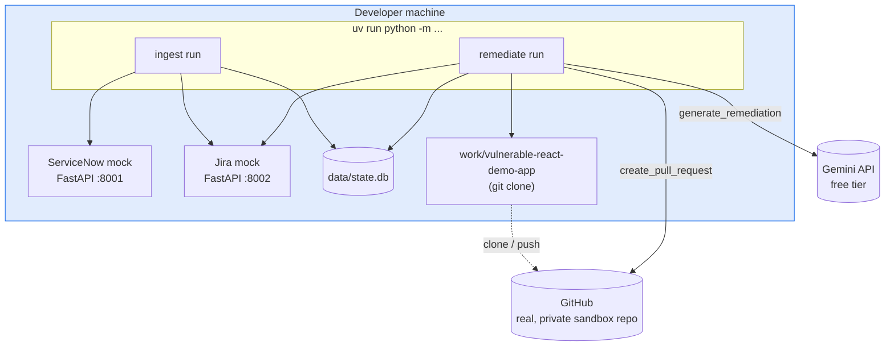
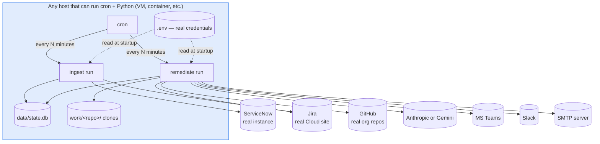

# 7. Deployment View

There is exactly one deployable artifact — the `ticket_remediation` Python package, run via two
CLI entrypoints. What changes between "zero-budget local dev" and "a real deployment" is entirely
which endpoints `.env` points at; no code or packaging differs.

## 7.1 Zero-budget / local mock mode

Everything runs as ordinary local processes started by hand — `uv run python -m
mock_servers.run_all` in one terminal, the CLIs in another. Only GitHub and the LLM provider are
real external services; ServiceNow and Jira are the two mocks. This is the mode used to build and
verify every feature in this project, including the live end-to-end proof in
[Cross-Cutting Concerns](08-cross-cutting-and-risks.md#testing-strategy).

## 7.2 Real-service, cron-scheduled deployment

**Nothing about this diagram requires a specific host type** — the only requirements are: Python
3.11+, `uv` (or a pre-built venv), `git`, network egress to the six external systems, and a place
for `data/state.db` and `work/` to persist between runs (both are plain files/directories — no
managed storage needed). A single small VM, a container with a persistent volume, or a scheduled
CI job with a cache are all equally valid. [`deploy/`](../../deploy/) has three worked examples —
a bare checkout with cron, a bare checkout with systemd timers, and the root
[`Dockerfile`](../../Dockerfile) — and `remediate sync-pr-status` (see
[Data & State Model §5.3](05-data-and-state-model.md#53-state-machine--remediation_runsstatus))
is meant to run on its own, more frequent schedule than `run`, since it never touches `work/` or
Jira/the LLM.

**What must persist across runs**, and why:

| Path | Why it must survive between invocations |
|---|---|
| `data/state.db` | Idempotency — losing it doesn't corrupt anything, but (as found during live testing) can cause a transient collision with GitHub if a PR from a "forgotten" run still exists; see the state-machine notes in [Data & State Model](05-data-and-state-model.md#53-state-machine--remediation_runsstatus) |
| `work/<repo>/` | Reused (not deleted) across runs so a failed remediation is inspectable on disk, and so `git fetch`/`reset` is cheaper than a fresh clone every time |
| `.env` | Credentials — never committed, see [Security](08-cross-cutting-and-risks.md#security) |

**What does not need to persist:** nothing else. There is no cache, no queue, no session state,
no in-memory data that survives past a single `run` invocation — restarting the host loses
nothing beyond the two paths above.
